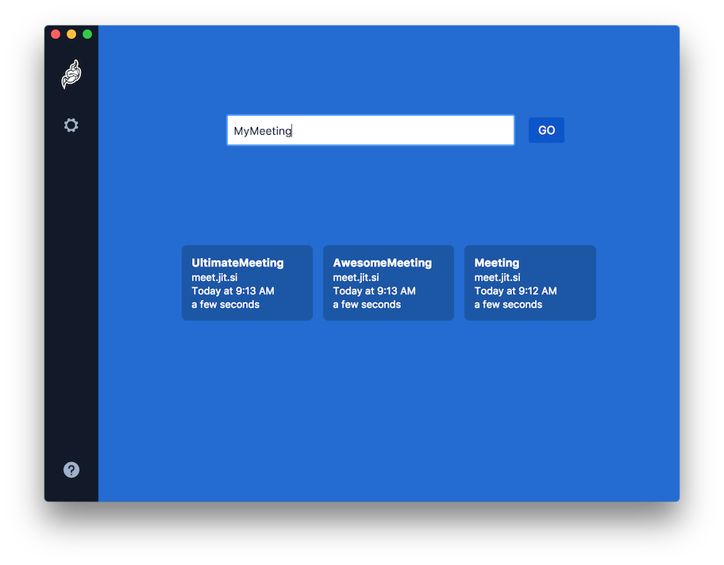

# Jitsi Meet Electron

Desktop application for [TeamCloud] built with [Electron].

Thanks to the Team at Jitsi for providing this App! We have optimised it to use the TeamCloud Server by default! 

## Features

- Works with any Jitsi Meet deployment
- Local settings
- Builtin auto-updates
- Remote control
- Always-On-Top window

## License

Apache 2. See the [LICENSE] file.

## Community

Jitsi is built by a large community of developers, if you want to participate,
please join [community forum].

[TeamCloud]: https://teamcloud.work
[Jitsi Meet]: https://github.com/jitsi/jitsi-meet
[Electron]: https://electronjs.org/
[latest release]: https://github.com/jitsi/jitsi-meet-electron/releases/latest
[jitsi-meet-electron-utils]: https://github.com/jitsi/jitsi-meet-electron-utils
[jitsi-meet-electron-utils README]: https://github.com/jitsi/jitsi-meet-electron-utils/blob/master/README.md
[community forum]: https://community.jitsi.org/
[LICENSE]: LICENSE
